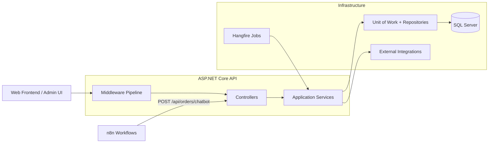
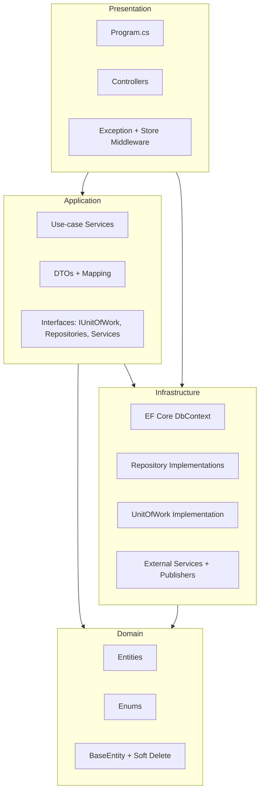
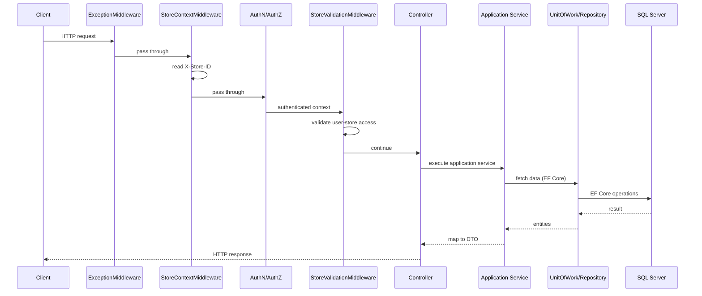
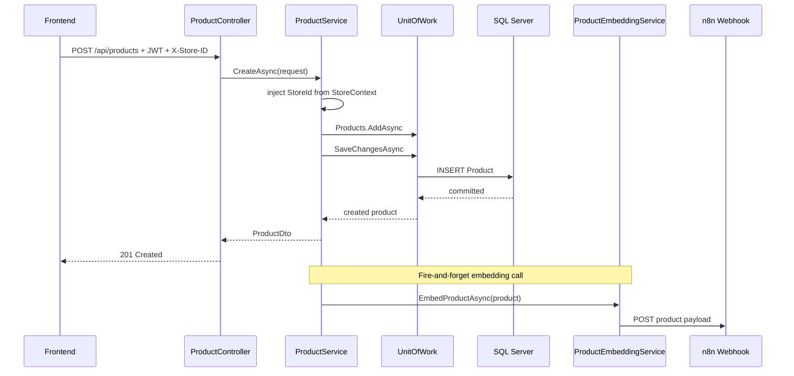
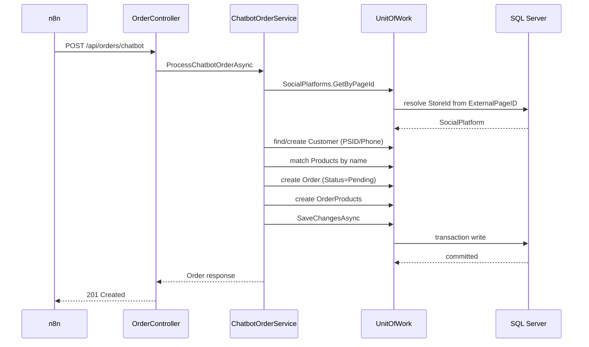
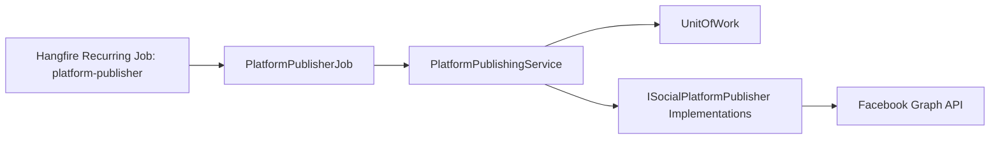
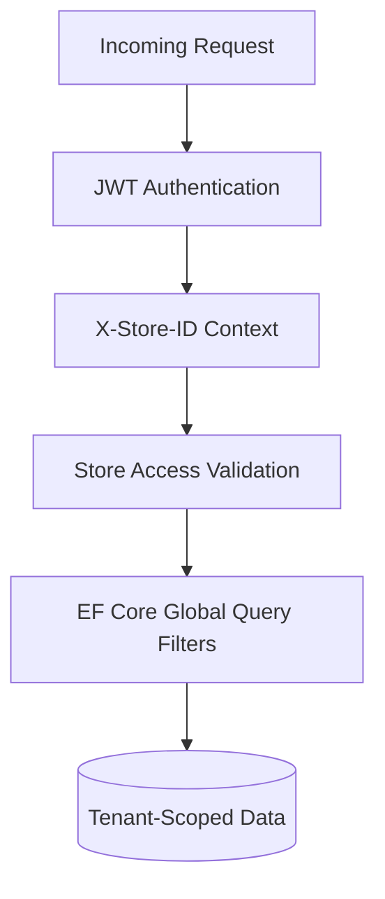

# Architecture Diagrams and System Design

This document explains how the current backend is organized and how requests move through the system.

It is written as a quick technical walkthrough for reviewers.

---

## 1) System at a Glance

Simple flow:

Facebook -> n8n -> Backend (.NET) -> Database -> Frontend

---

## 2) Layered Architecture

### Responsibility split

- **Presentation**: HTTP contract, middleware, auth flow, endpoint exposure.
- **Application**: business rules, orchestration, transaction boundary coordination.
- **Domain**: core business model independent of frameworks.
- **Infrastructure**: persistence and external systems.

---

## 3) Request Pipeline (Store-Scoped APIs)

---

## 3.1) System Flow

1. Customer sends a message via Facebook.
2. n8n processes the message and prepares a structured order payload.
3. Backend receives the order through `POST /api/orders/chatbot`.
4. The order is stored in SQL Server and linked to the correct store.
5. Admin reviews the new order in the dashboard.

---

## 4) Product Flow with Async Embedding

Why this matters:

- API latency is not blocked by embedding webhook execution.
- Product write path remains resilient even if integration is unavailable.

---

## 5) Chatbot Order Intake (n8n -> API)

Design intent:

- n8n handles conversation logic.
- API handles persistence, validation, and order lifecycle initiation.

---

## 6) Scheduled Publishing Architecture

Key behavior:

- Processes only due, pending platform posts.
- Marks records as `Publishing` before external calls to reduce duplicate execution risk.
- Updates per-platform and aggregate post status after execution.

---

## 7) Data Isolation and Security Model

Controls in place:

- JWT-based authentication and authorization.
- Store membership/ownership validation before store-scoped operations.
- EF Core global filters for soft-delete and store scoping.

---

## 8) Core Technical Decisions

1. **Repository + Unit of Work on EF Core**
   - Keeps data access consistent and transaction boundaries explicit.

2. **Middleware-first tenant resolution**
   - Centralizes tenant context instead of repeating logic in each endpoint.

3. **Service-oriented application layer**
   - Business rules remain outside controllers and persistence layer.

4. **Background processing for scheduled work**
   - Time-based publishing runs independently from request/response paths.

5. **Integration boundaries behind interfaces**
   - External platforms are isolated through `ISocialPlatformPublisher` and service abstractions.

---

## 9) What This Demonstrates to Reviewers

- Clear separation of concerns across a real multi-project .NET backend.
- Practical multi-tenant API design with layered enforcement.
- Production-oriented handling of async integrations and scheduled jobs.
- Maintainable structure that supports feature growth without controller bloat.

This is the architecture currently implemented in the repository.
